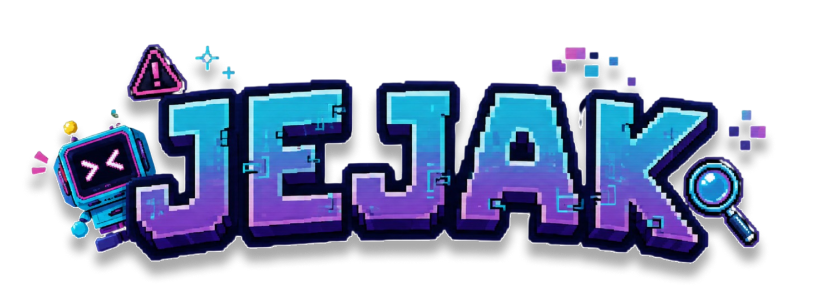
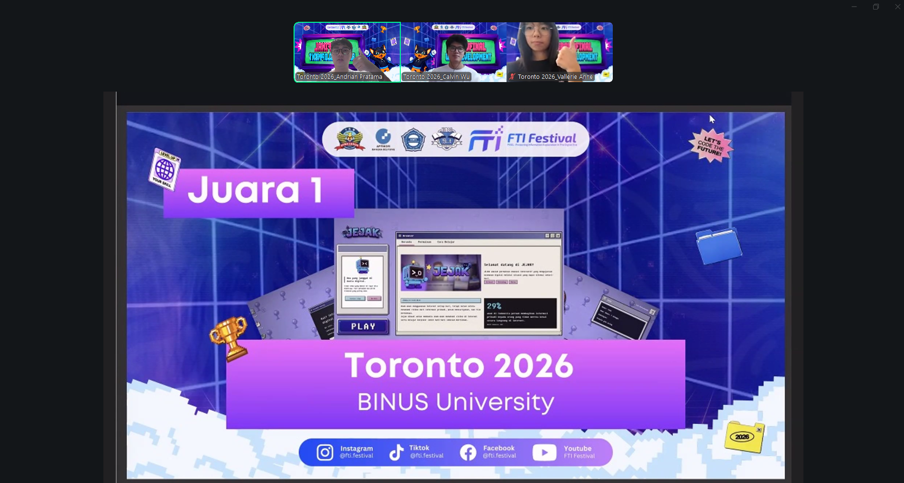

<p align="center">
  
</p>

# Jejak

**Belajar menjaga jejak digital melalui permainan yang aman, singkat, dan interaktif.**

Jejak adalah platform permainan literasi keamanan digital berbahasa Indonesia. Pengalaman utamanya menggunakan desktop retro dengan tiga latihan: menjaga informasi pribadi, mengenali phishing, dan menangani file unduhan secara aman.

---

## Achievement

**1st Place - FTI Festival 2026**  
Category: **Web Development**

Jejak was awarded 1st place in the Web Development category at FTI Festival 2026, held at SB Atma Luhur in Pangkalpinang.

<p align="center">
  
</p>

---

## Mengapa Jejak

Keamanan digital tidak cukup dipelajari sebagai daftar aturan. Pemain perlu melihat situasi yang menyerupai keputusan sehari-hari, memilih tindakan, lalu memahami alasan di balik hasilnya.

Jejak menjaga alur tersebut tetap jelas:

1. Pemain masuk melalui browser virtual pada desktop Jejak.
2. Pemain memilih permainan Privasi, Phishing, atau Virus.
3. Backend membuat sesi dan memilih materi secara acak.
4. Pemain mengambil keputusan dengan konteks dan petunjuk yang tersedia.
5. Backend memvalidasi jawaban serta menyimpan progres sesi yang selesai.

## Projects

| Project | Tanggung jawab |
| --- | --- |
| `Jejak-FE` | React web app untuk desktop retro, autentikasi, tutorial, dan gameplay |
| `Jejak-BE` | Express API untuk autentikasi, database, progres, sesi permainan, dan realtime WebSocket |

Dokumentasi product scope dan local development tersedia pada README utama workspace serta `PRD.md`.

## Technology Stack

| Layer | Teknologi |
| --- | --- |
| Web | React 19, Vite 8, TypeScript, Tailwind CSS 4, Motion |
| API | Node.js 22+, Express 5, TypeScript, Zod |
| Authentication | Better Auth dengan session cookie HTTP-only |
| Data | PostgreSQL dan Prisma 7 |
| Realtime | WebSocket untuk snapshot dan aksi sesi permainan |

## Prinsip Produk

- **Belajar melalui keputusan** — setiap permainan memberi konteks, tindakan, dan umpan balik yang dapat dipahami.
- **Backend adalah sumber kebenaran** — browser tidak menentukan kepemilikan sesi, skor final, atau status selesai sendiri.
- **Privasi log** — password, cookie, token, email, nama, dan identifier sensitif tidak ditampilkan pada log request.
- **Akses terikat pengguna** — route dan WebSocket permainan memvalidasi autentikasi serta kepemilikan sesi.
- **Aksesibilitas praktis** — interface menggunakan kontrol semantik, navigasi keyboard, live region, fokus route, dan reduced motion pada alur utama.

## Local Development

Backend:

```bash
cd Jejak-BE
npm ci
copy .env.example .env
npm run prisma:migrate:dev
npm run dev
```

Frontend:

```bash
cd Jejak-FE
npm ci
copy .env.example .env
npm run dev
```

Frontend berjalan pada `http://localhost:5173` dan backend pada `http://localhost:3000` secara default.

## Current Scope

Implementasi aktif mencakup autentikasi email/password, desktop retro, tiga permainan terautentikasi, tutorial, sesi realtime, penyimpanan progres, rate limiting, dan kontrol keamanan HTTP dasar.

Inbox desktop, dedicated progress screen, test suite, CI, serta dokumentasi lisensi project dan aset belum menjadi bagian lengkap dari scope aktif.
